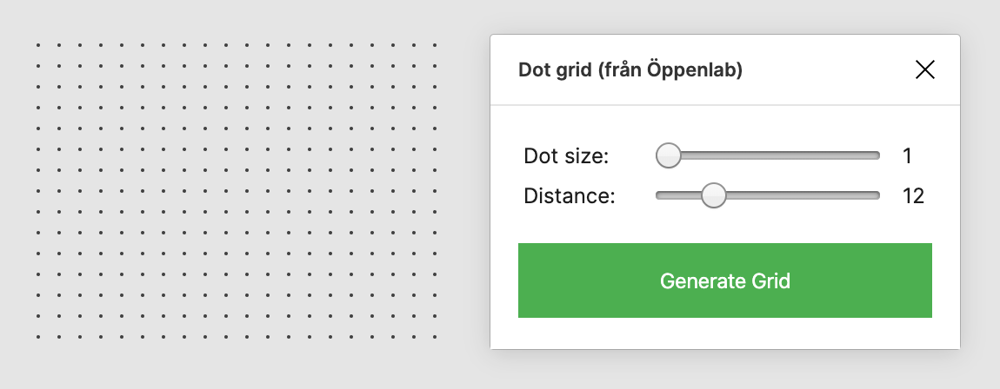

# Dot Grid (från Öppenlab)

Dot plugin for [Figma](https://www.figma.com/).

## Installation

Currently you'll need to set up [Figma for plugin development](https://www.figma.com/plugin-docs/intro/), install [VS Code](https://code.visualstudio.com/), and clone this repository. 

## Usage

Converts any rectangle shape into a grid of dots:

* Select a rectangle
* Launch Dot grid
* Set the dot size and spacing
* Click _Generate_

To keep things responsive there's a limit on the number of dots generated by the plugin, if you need to create a bigger canvas then run the plugin then duplicate and group the generated vector.
